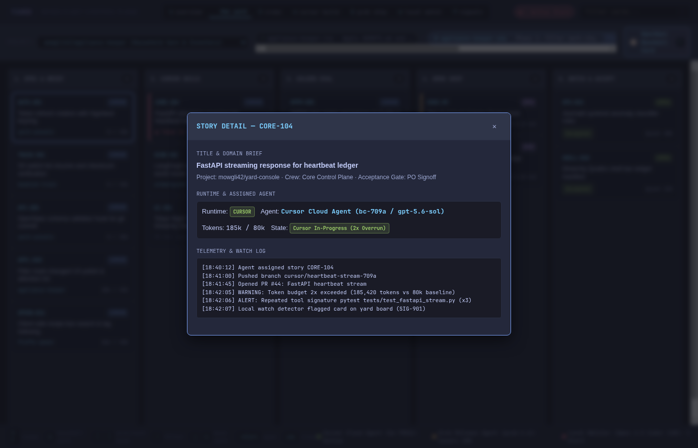
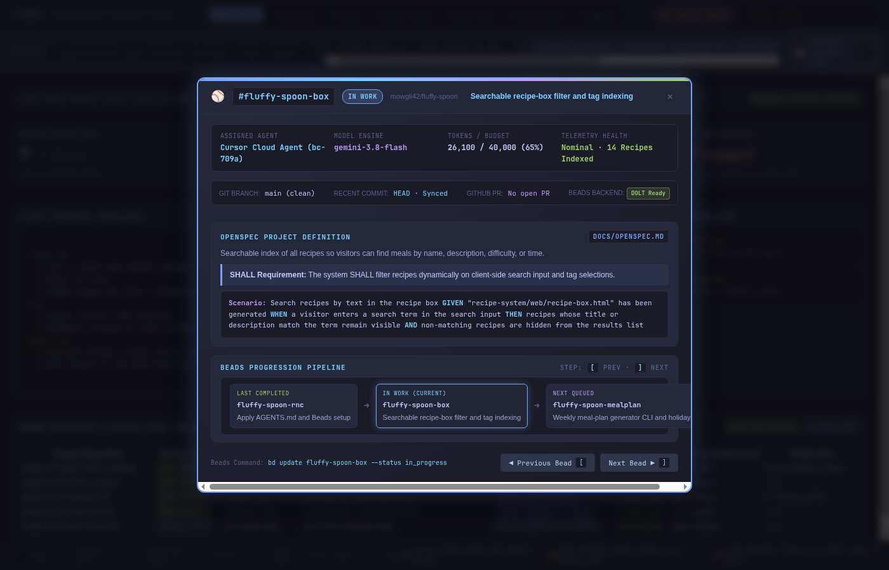
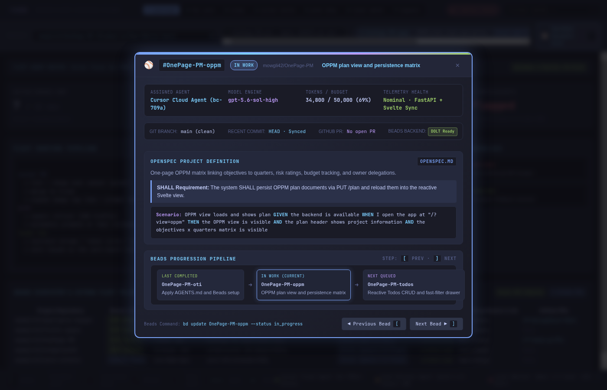
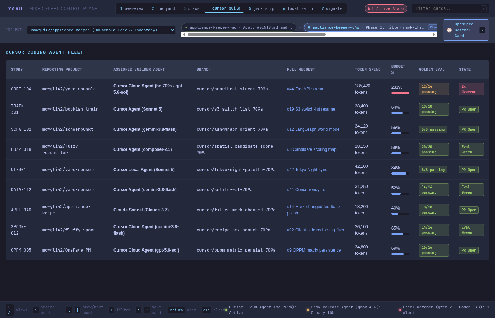
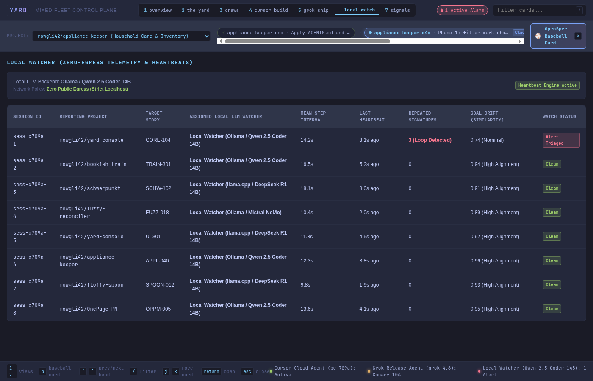

# YARD

Internal preview. Not for distribution.


YARD is a mixed-fleet control plane for work that already happens in the building:

- **Cursor** builds the app and opens the PR.
- **Grok** ships the tagged build (canary, promote, rollback).
- **A local LLM** reads logs and heartbeats. No egress. No code. No deploy.

Humans remain product owners. Scrum-master agents cap WIP. Each domain is an agile crew with an assigned runtime.

## Surface

Open `index.html`. Tokyo Night. Keyboard first.


| key | action |
|---|---|
| `1–7` | views |
| `b` | openspec baseball card |
| `[` `]` | prev / next bead |
| `/` | filter |
| `j` `k` | move card |
| `return` | open detail |
| `esc` | close / dismiss |

### Forensic Agent Telemetry & Overrun Guard (`return`)


## OpenSpec & Beads Baseball Card Interface

The console integrates directly with **OpenSpec** capability definitions and **Beads** (`.beads/issues.jsonl`) linear progress pipelines:

- **Persistent Current Bead Ribbon:** Shows the project selector and the active 3-step bead pipeline: `[Last Completed]` ➜ `[In Work (Pulse)]` ➜ `[Next Queued]`.
- **Baseball Card Modal (`b`):**
  - **Player & Engine Stats:** Assigned agent (`Claude Sonnet 3.7`, `gemini-3.8-flash`, `gpt-5.6-sol`), model, token burn percentage, and heartbeat telemetry.
  - **OpenSpec Definition:** Linked spec document (e.g., `openspec/specs/filter-schedule/spec.md`, `docs/OPENSPEC.md`, `openspec.md`), capability purpose statement, and formal `SHALL` requirement clause.
  - **Executable Gherkin:** Syntax-highlighted `GIVEN` / `WHEN` / `THEN` scenario verifying the bead's acceptance criteria.
  - **Connected Trio Stepper:** Click any pill or press `[` / `]` to step between the last completed, current in-work, and next bead.

### Test Systems – OpenSpec Baseball Cards

#### 1. `mowgli42/appliance-keeper` (Household Care & Inventory)
*Agent: Claude Sonnet 3.7 · Spec: `openspec/specs/filter-schedule/spec.md` · Active Bead: `appliance-keeper-o4o`*


#### 2. `mowgli42/fluffy-spoon` (Culinary Knowledge & Static Engine)
*Agent: Cursor Cloud Agent (gemini-3.8-flash) · Spec: `docs/OPENSPEC.md` · Active Bead: `fluffy-spoon-box`*


#### 3. `mowgli42/OnePage-PM` (Product & Plan Matrix Core)
*Agent: Cursor Cloud Agent (gpt-5.6-sol-high) · Spec: `openspec.md` · Active Bead: `OnePage-PM-oppm`*


## Agent Crews Across Projects

The **Crews View (`3`)** manages autonomous agile crews working concurrently across distinct repositories, each assigned a dedicated scrum-master agent and runtime budget:


## Views

1. **overview:** Fleet summary, agent roster, pipeline flow, and anomaly alerts.
2. **the yard:** 5-column Kanban board (Spec & Brief, Cursor Build, Golden Eval, Grok Ship, Watch & Accept).
3. **crews:** Multi-project domain teams (`appliance-keeper`, `fluffy-spoon`, `OnePage-PM`, `schwerpunkt`, `yard-console`, `bookish-train`, `fuzzy-reconciler`), POs, scrum-master agents, and per-crew WIP caps.
4. **cursor build:** Builder fleet tracking, branch references, PR status, token spend, and golden evals.
5. **grok ship:** Image tags, commit SHAs, canary traffic allocation, and rollback targets.
6. **local watch:** On-premise zero-egress telemetry, heartbeat intervals, tool loop detection, and goal drift.
7. **signals:** Real-time stream of detector warnings, budget overrun alarms, and soak notifications.

### Cursor Build Fleet (`4`)


### Zero-Egress Local Watch Telemetry (`6`)


## Where Agents Are Identified in the Console

| Display Location | Identified Agents & Models | Context & Purpose |
|---|---|---|
| **Top Fleet Roster Bar** | `Cursor Cloud (bc-709a / gpt-5.6-sol)`, `xAI Grok (grok-4.6)`, `Local Watcher (Ollama / Qwen 2.5 Coder 14B)` | High-level fleet capabilities and active agent roster. |
| **Hero Metric Cards (View 1)** | `Cursor Cloud & Sonnet 5`, `xAI Grok Release Agent`, `Local LLM (Qwen 2.5 Coder 14B)` | Real-time ownership of in-flight stories, canaries, and alerts. |
| **Kanban Card Badges (View 2)** | `Cursor` (Blue), `Grok` (Purple), `Local` (Green) | At-a-glance runtime delegation on the board. |
| **Card Detail Drawer (`return`)** | Full Model Spec & Agent ID (e.g. `Cursor Cloud Agent bc-709a / gpt-5.6-sol`) | Forensic execution telemetry, tool signature loops, token overruns. |
| **Crews Matrix (View 3)** | `agent-scrum-core`, `agent-scrum-appliance`, `agent-scrum-culinary`, `agent-scrum-oppm`, `agent-scrum-backup`, `agent-scrum-ooda`, `agent-scrum-reconcile`, `agent-scrum-release`, `agent-scrum-watch` | Scrum-master agents capping WIP across 7 distributed repositories. |
| **Cursor Build Table (View 4)** | `Claude Sonnet (Claude-3.7)`, `Cursor Cloud (gpt-5.6-sol / gemini-3.8-flash)`, `Cursor Local (Sonnet 5)`, `composer-2.5` | Granular builder model attribution per branch, repo & PR. |
| **Local Watch Table (View 6)** | `Ollama / Qwen 2.5 Coder 14B`, `llama.cpp / DeepSeek R1 14B`, `Mistral NeMo` | Zero-egress local observer models watching heartbeats across repos (`appliance-keeper`, `fluffy-spoon`, `OnePage-PM`, `schwerpunkt`). |
| **Beads Active Ribbon (Header)** | Current in-work bead ID (`appliance-keeper-o4o`, `fluffy-spoon-box`, `OnePage-PM-oppm`, `schwerpunkt-i0i.3.1`), assigned agent, live pulse | Continuous task attribution across multiple project repositories. |
| **Beads & GitHub Matrix (View 1)** | Fleet adoption rate, issue backend (Dolt/JSONL), git dirty state, and open GitHub PRs per repo | Deep ecosystem adoption scorecard and pull request linkage. |
| **OpenSpec Baseball Card (`b`)** | Assigned agent (`Claude Sonnet 3.7`, `gemini-3.8-flash`, `gpt-5.6-sol`), engine model, token burn, git branch, commit hash, and PR # | Glanceable athlete-card stats, formal `SHALL` spec requirement, Git metadata, and Gherkin BDD scenario. |
| **Omarchy Quickshell HUD (`BarWidget.qml` / `Panel.qml`)** | Dynamic Bar button tooltip (`YARD [6/7 Beads] In-Work: ...`), Beads adoption score, agent state, and GitHub telemetry | Linux desktop integration via Omarchy shell status bar. |
| **Persistent Footer Status Bar** | `Cursor Cloud Agent: Active`, `Grok Release Agent: Canary 10%`, `Local Watcher: 1 Alert` | Always-visible agent health LEDs across all views. |

## Live Operation & Repository Management

The console is fully functional and monitors real repository state:
1. **Local State Daemon (`yard-sync`):** Continuously scans `.beads/issues.jsonl` and `openspec/specs/` across all configured repositories, formatting unified status JSON into `~/.local/state/yard/status.json` and `data/status.json`.
2. **Web Live Polling:** The console polls `data/status.json` and updates the active bead ribbon, project selector, and baseball cards in real time without refreshing.
3. **Omarchy Quickshell Plugin:** The status script (`plugin/omarchy/bin/yard-status`) reads this same state, updating the Linux desktop bar and HUD.

### Starting the Live Console

Run the bundled launcher:
```bash
./scripts/yard-start.sh
```
This runs the background `yard-sync` daemon and serves `http://localhost:8000`.

### Adding an Existing Repository

To link an existing workspace repository to the YARD console:
```bash
./scripts/yard-add-repo.py /home/tprettol/repo/appliance-keeper \
  --crew "Household Care & Inventory" \
  --agent "Claude Sonnet (Claude-3.7)" \
  --model "claude-sonnet-5-thinking-high"
```
The script will:
- Auto-detect git origin remote slug or directory name.
- Verify or initialize `.beads/` and `openspec/`.
- Register the repo in `config/repos.json`.
- Trigger an immediate sync so it appears in the console project selector.

### Installing and Activating the Omarchy Plugin

The plugin directory (`plugin/omarchy/`) can be linked directly into Omarchy's user plugin directory:
```bash
# Link plugin to user directory
ln -sfn /home/tprettol/repo/yard-console/plugin/omarchy ~/.config/omarchy/plugins/omarchy.yard-console

# Add widget to status bar in ~/.config/omarchy/shell.json under "bar.layout.right"
# { "id": "omarchy.yard-console" }
```
When active on the status bar:
- Displays `󱚣` with dynamic tooltip reflecting Beads adoption (`YARD [6/7 Beads] In-Work: appliance-keeper-o4o`).
- Clicking opens the Quickshell HUD with real-time Beads Adoption Scorecard, Active Trio, Agent Status, Git Working Branch, and latest GitHub PR.
- One-click button launches the full Tokyo Night web console.

### Active Test Repositories

The YARD control plane monitors the following real workspace repositories:
- `mowgli42/appliance-keeper`: Local-first household care, appliance registry, and filter schedule tracker. Assigned agent: Claude Sonnet (Claude-3.7). Active Bead: `appliance-keeper-o4o`. OpenSpec living specs under `openspec/specs/filter-schedule/spec.md`.
- `mowgli42/fluffy-spoon`: Static recipe system with XML catalog and client-side recipe box. Assigned agent: Cursor Cloud Agent (bc-709a / gemini-3.8-flash). Active Bead: `fluffy-spoon-box`. OpenSpec under `docs/OPENSPEC.md` and BDD features under `features/recipe-box.feature`.
- `mowgli42/OnePage-PM`: One-Page Project Management (OPPM) matrix with FastAPI backend and Svelte frontend. Assigned agent: Cursor Cloud Agent (bc-709a / gpt-5.6-sol). Active Bead: `OnePage-PM-oppm`. OpenSpec contracts in `openspec.md` and BDD scenarios in `features/oppm-plan.feature`.
- `mowgli42/schwerpunkt`: Boyd OODA orientation-first platform with active beads and living specs in `openspec/specs/`. Active Bead: `schwerpunkt-i0i.3.1`.

### Adding a New Repository from Scratch

To create and scaffold a brand new repository with Beads issue tracking and OpenSpec living specs:
```bash
./scripts/yard-add-repo.py /home/tprettol/repo/new-service \
  --new \
  --slug "mowgli42/new-service" \
  --crew "Telemetry Stream" \
  --init-beads \
  --init-openspec
```
This creates:
- Initialized Git repository (`git init`).
- `.beads/config.yaml` and starter issue in `.beads/issues.jsonl`.
- `openspec/project.md` and initial capability contract in `openspec/specs/core-capability/spec.md`.
- Immediate registration in YARD fleet config.

---

## What this is not

Not a waitlist. Not a model vendor. Not a replacement for Cursor, Grok, or the box that runs the local model. It is the board those three report to.

## Status

Stealth preview. Contracts and detector rules are documented in `docs/ARCHITECTURE.md`.

## Documentation & Architecture

- **C4 Architecture & Pipeline Flow:** [`docs/C4-ARCHITECTURE.md`](docs/C4-ARCHITECTURE.md) (Context, Containers, Components, Pipeline Flow)
- **AI Tools Integration Matrix:** [`docs/AI-INTEGRATIONS.md`](docs/AI-INTEGRATIONS.md) (Cursor, Grok, Local LLMs, Claude Code, MCP servers)
- **Omarchy Shell Plugin Plan:** [`docs/OMARCHY-PLUGIN-PLAN.md`](docs/OMARCHY-PLUGIN-PLAN.md) (Quattro bar widget & Quickshell HUD)
- **OpenSpec & Gherkin Specs:** [`openspec/project.md`](openspec/project.md) and [`openspec/features/`](openspec/features/)
- **Native Omarchy Plugin:** [`plugin/omarchy/`](plugin/omarchy/) (`manifest.json`, `BarWidget.qml`, `Panel.qml`, `bin/yard-status`)
