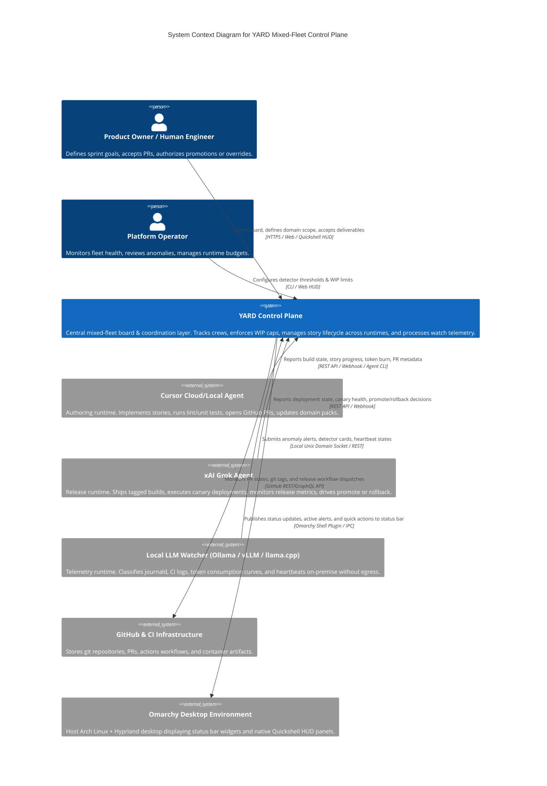
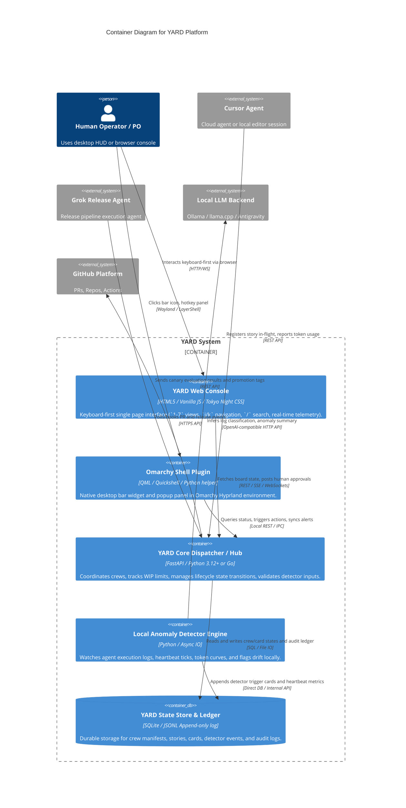
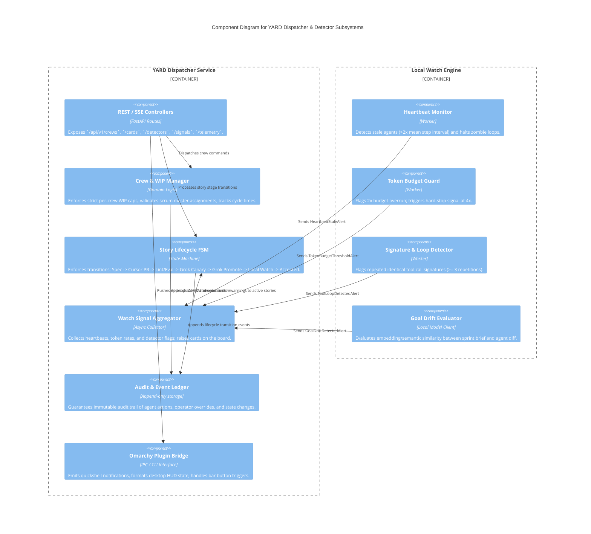

# YARD C4 Architecture Documentation

YARD is a mixed-fleet control plane for multi-agent software engineering and continuous delivery. It enforces strict separation of concerns across runtime boundaries (Cursor for build/PR creation, Grok for ship/tag/canary/promote/rollback, Local LLMs for log/heartbeat watch, and Humans for Product Ownership and Sprint Governance).

---

## C4 Model — Level 1: System Context Diagram

The System Context diagram illustrates the actors (Human Product Owners, Platform Engineers) and the external AI systems/runtimes that interact with YARD.



---

## C4 Model — Level 2: Container Diagram

The Container diagram breaks YARD into its high-level runtime components: the Web Console, the Omarchy Shell Plugin, the Core API/Event Broker, and the Storage/State stores.



---

## C4 Model — Level 3: Component Diagram (Core Dispatcher / Hub)

Detailed internal component breakdown of the YARD Dispatcher and local detector engine.



---

## C4 Model — Level 4: Code & Data Flow Diagram (The Three-Runtime Pipeline)

This sequence illustrates the end-to-end lifecycle of a story across the three runtime boundaries:

```mermaid
sequenceDiagram
    autonumber
    actor PO as Human Product Owner
    participant YARD as YARD Dispatcher
    participant Cursor as Cursor Runtime
    participant CI as GitHub CI & Registry
    participant Grok as Grok Runtime
    participant LocalWatch as Local LLM Watcher
    participant Omarchy as Omarchy Desktop HUD

    Note over PO,Cursor: 1. Sprint & Build Phase
    PO->>YARD: Assigns story to Crew (e.g. Core Engine)
    YARD->>YARD: Checks Crew WIP Cap (Permit / Deny)
    YARD->>Cursor: Dispatches story task context & Domain Pack
    activate Cursor
    Cursor->>Cursor: Writes implementation, unit tests, Gherkin features
    Cursor->>CI: Pushes branch & opens Pull Request
    Cursor->>YARD: Reports token burn & PR #123 opened
    deactivate Cursor

    Note over Cursor,CI: 2. Verification & Tagging
    CI->>CI: Runs lint + cheap eval subset
    CI-->>YARD: Eval green, merge approved
    YARD->>CI: Creates image tag (SHA + prompt hash + eval snapshot)

    Note over Grok,CI: 3. Release & Canary Phase
    YARD->>Grok: Dispatches Canary Deployment Task
    activate Grok
    Grok->>CI: Triggers canary deploy to staging/edge
    Grok->>Grok: Evaluates canary error rates & operator notes
    alt Canary Successful
        Grok->>CI: Promotes tag to production
        Grok->>YARD: Reports Promote Completed (Release Note generated)
    else Canary Fails or Degraded
        Grok->>CI: Issues Rollback to previous known good tag
        Grok->>YARD: Reports Rollback Triggered with incident summary
    end
    deactivate Grok

    Note over LocalWatch,Omarchy: 4. Local Watch & Observability
    LocalWatch->>LocalWatch: Streams journald/CI logs, parses heartbeat pulses
    LocalWatch->>LocalWatch: Runs detectors (Zero-error high token, tool loop, goal drift)
    alt Anomaly Detected
        LocalWatch->>YARD: Raises Alert Card on YARD Board (No auto-fix, no code mutation)
        YARD->>Omarchy: Alerts desktop via Omarchy Bar Badge & OSD notification
        Omarchy-->>PO: Visual indicator on bar ("󱚣 1 Alert")
    else Normal Telemetry
        LocalWatch->>YARD: Quiet status heartbeat
    end

    Note over PO,YARD: 5. Final Acceptance
    PO->>YARD: Verifies deliverables on board; accepts story
    YARD->>YARD: Increments Crew Completed, releases WIP slot
```

---

## Architecture Decision Records (ADRs) Summary

| ADR ID | Decision | Key Rationale |
|---|---|---|
| **ADR-001** | Strict Three-Runtime Isolation | Cursor should not touch prod cluster/secrets; Grok should not reopen brief; Local LLM triage stays on-premise without cloud egress cost or privacy exposure. |
| **ADR-002** | Per-Crew WIP Caps over Global WIP | Different functional crews operate at different cadences and token budgets. Capping per crew prevents starvation and limits blast radius of runaway subagent loops. |
| **ADR-003** | Local-First Passive Detectors | Detectors identify anomalies and raise cards on the board; they NEVER unilaterally mutate code or force deploys. The human PO remains in control. |
| **ADR-004** | Dual Interface: Web Console & Native Omarchy Plugin | Browser provides deep multi-panel board navigation; Omarchy native QML plugin provides at-a-glance status bar health and desktop notification integration. |
